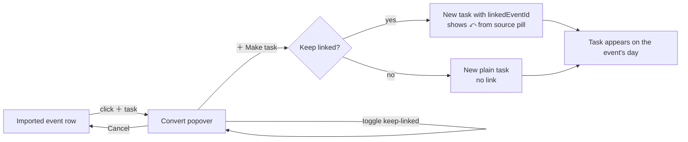

# Design

> **Source of truth:** this doc is re-derived from the design export in
> [`/design`](../design/) — `Openweek v2 (paper).dc.html` (the "paper" layout). When the design file
> and this doc disagree, the design file wins; update this doc. The earlier `Openweek v1 (sidebar)`
> export is **superseded** (see [Rejected v1 layout](#rejected-v1-layout)).

The whole appeal of this category is that it feels like a **paper planner**, not a SaaS dashboard.
This doc captures the aesthetic, the exact theme tokens, typography, the anatomy of every surface and
its states, the interaction flows, accessibility, and the responsive/DnD behaviour the components must
honour.

## Aesthetic principles

- **Warm off-white / cream** surfaces, never pure UI white. Three stacked paper tones: a page mat
  (`#F2F1EC`), the week grid sheet (`#FFFFFF`), and a slightly warmer list drawer (`#FCFBF7`).
- **Hairline rules** between days and around chrome, like ruled notebook paper — thin `1px` borders,
  **no heavy drop shadows**. The only real shadow in the design is the convert-event popover.
- **Generous whitespace.** Minimal chrome. The week grid breathes; the top bar and drawer are quiet.
- **Highlighter-style task colors** — muted pastel tags (butter, mint, sky, rose) applied like a
  highlighter swipe or underline on paper, not as saturated UI chips.
- **Monospaced display type** gives the "planner / typewriter" feel; the accent color is the only
  saturated thing on the page and it is **user-chosen**.
- Dark mode is a second theme with the same restraint (warm charcoals, pastels shifted down in
  lightness).

## Theme tokens (exact values from the design)

These hex values are the **spec**. They may be expressed in OKLCH in `main.css` (see
[Theme setup](#theme-setup-tailwind-v4--daisyui-5-css-first)), but these are the canonical targets.

### Surfaces & ink

| Token | Hex | Use |
|---|---|---|
| `--ow-page` | `#F2F1EC` | page mat behind the app frame |
| `--ow-surface` | `#FFFFFF` | week-grid sheet |
| `--ow-drawer` | `#FCFBF7` | bottom list drawer |
| `--ow-ink` | `#2A2A28` | primary text |
| `--ow-hairline` | `#EDEBE4` | day rules, header/drawer borders |
| `--ow-line-soft` | `#E7E4DB` | control borders, pills |
| `--ow-selection` | `#EAD9A0` | `::selection` highlight |

Muted text ramp (light → dark gray, warm): `#C8C4BA` · `#C4BEB0` · `#BBB7AC` · `#AEA99D` ·
`#ADA89C` · `#9A968C` · `#8C887D`. Used for labels, counts, meta, ghost text, and disabled chevrons.

### Accent (user-selectable, runtime CSS var)

The accent is a single runtime `--color-accent` var (see [decisions.md](./decisions.md) D15), set from
the user's `accentColor`. Four options; **sky is the default**.

| Name | Hex | |
|---|---|---|
| Butter | `#EAD9A0` | |
| Mint | `#CFE0CB` | |
| **Sky** | `#CBDDE9` | **default** |
| Rose | `#E7CDD4` | |

The accent colors: the brand square, the **today** date circle, the today column tint (`accent @10%`),
the active list-tab underline, the "Write a task" caret, and primary buttons. On accent backgrounds,
text uses a deep warm tone (`#5C5226`-family) for contrast — provide a paired `*-content` per accent.

### Highlighter tag colors

Tag colors are distinct from the accent (a task tagged "butter" stays butter regardless of accent).
The DB stores the legacy union `'yellow'|'pink'|'blue'|'green'`; these map to the v2 palette
(see [decisions.md](./decisions.md) D15):

| Tag (UI name) | DB value | Hex |
|---|---|---|
| Butter | `yellow` | `#EAD9A0` |
| Mint | `green` | `#D2E2CD` |
| Sky | `blue` | `#CFDEEA` |
| Rose | `pink` | `#E9D2D8` |

### Calendar source colors

Imported event rows are keyed to their source (see [calendar-sync.md](./calendar-sync.md)):

| Source | Hex |
|---|---|
| Google Calendar (GCal) | `#86B08B` |
| CalDAV | `#9CBBD6` |
| iCal | `#D3B488` |

## How much DaisyUI

DaisyUI is **plumbing, not the chassis**:

- **Use it for:** theme tokens (`base-100/200/300`, `base-content`), the dark-mode mechanism, and
  a11y-sensitive primitives that are tedious to hand-roll — `modal`/`dialog` (task notes, confirm
  delete), `dropdown` (color picker, calendars menu, move menu), `toast` (undo), and form controls
  (`checkbox`, `input`, `textarea`).
- **Go custom for:** the **week grid**, **DayColumn**, **task row**, **imported-event row**, the
  **convert-event popover**, and the **list drawer + tabs**. These are the product and the aesthetic;
  DaisyUI's `card`/`list` ship shadows/radii/spacing that fight the hairline paper look.

To stop DaisyUI primitives from looking "SaaS": set `--depth: 0`, `--noise: 0`, `--border: 1px`, and
small radii in the theme.

## Theme setup (Tailwind v4 + DaisyUI 5, CSS-first)

Single CSS entry, no `tailwind.config.js`. Hex values below are the design spec (OKLCH equivalents are
fine — keep the visual result identical):

```css
/* app/assets/css/main.css */
@import "tailwindcss";
@plugin "daisyui";

@plugin "daisyui/theme" {
  name: "paper";
  default: true;
  color-scheme: light;
  --color-base-100: #FFFFFF;   /* week-grid sheet */
  --color-base-200: #FCFBF7;   /* list drawer / faint elevation */
  --color-base-300: #F2F1EC;   /* page mat */
  --color-base-content: #2A2A28;
  --depth: 0; --noise: 0; --border: 1px;
  --radius-box: 0.375rem; --radius-field: 0.5rem;
}

@plugin "daisyui/theme" {
  name: "paper-dark";
  prefersdark: true;
  color-scheme: dark;
  /* warm charcoal base-*, pastels shifted down in lightness so they read as soft accents */
}

/* App tokens that must survive purge and be usable as utilities */
@theme {
  --color-hairline: #EDEBE4;
  --color-line-soft: #E7E4DB;
  /* highlighter tags — names map to the legacy DB union (see D15) */
  --color-tag-yellow: #EAD9A0;  /* butter */
  --color-tag-green:  #D2E2CD;  /* mint   */
  --color-tag-blue:   #CFDEEA;  /* sky    */
  --color-tag-pink:   #E9D2D8;  /* rose   */
}
```

`--color-accent` is **not** a DaisyUI theme value — it is set on `:root` by a small client plugin from
the user's `accentColor` (butter/mint/sky/rose), so changing the accent recolors live without a theme
rebuild. Switch light/dark via `data-theme` on `<html>` synced to `usePreferredDark` (VueUse) + a
manual toggle.

## Typography

The display face is **monospaced** (the planner/typewriter feel); the body is a clean humanist sans.
Both are **self-hosted via `@fontsource/*`** — no Google Fonts CDN — to keep a self-hosted box
offline-capable and private (see [tech-stack.md](./tech-stack.md), [decisions.md](./decisions.md) D19).

The design exposes a per-user **`fontStyle`** setting with four pairings, driven by `--ow-display`
and `--ow-body` CSS vars:

| `fontStyle` | Display (`--ow-display`) | Body (`--ow-body`) |
|---|---|---|
| **Plex Mono** (default) | IBM Plex Mono | IBM Plex Sans |
| Editorial | Newsreader (serif) | IBM Plex Sans |
| Grotesk | Space Grotesk | Space Grotesk |
| Typewriter | Spline Sans Mono | IBM Plex Sans |

Display type carries: the brand wordmark, week title + week number, day dates/labels, every task
line, meta badges, list-tab labels, and buttons. Body sans is used for incidental UI prose. Notes
render *italic* in the body face.

> Supersedes the v1 choice of Inter + Caveat. The handwritten-accent idea is dropped; the "character"
> now comes from the monospaced display face and the chosen `fontStyle`.

## Highlighter styles (per-user `tagStyle`)

A tagged task is highlighted in one of two styles, a per-user `tagStyle` setting:

- **Underline** (default): a bottom-anchored gradient — the tag color fills the lower ~42% of the line,
  transparent above, like a highlighter dragged under the words.
- **Swipe:** the full text background is the tag color (`padding: 1px 4px; border-radius: 3px`), like a
  highlighter swiped across the words. Wraps cleanly via `box-decoration-break: clone`.

Done tasks keep the highlight but drop to a muted ink (`#9A968C` underline / `#80796C` swipe) with a
`line-through`.

## Anatomy & flows

The app is a single full-height frame: **top bar → 7-column week grid → bottom list drawer**. There is
**no sidebar**. Below, each surface and the states it must support.

### Top bar

`brand · week-nav · ⟶ · right cluster`, separated from the grid by a hairline.

- **Brand:** accent square + lowercase `openweek` wordmark (display face, 600).
- **Week nav:** `‹` / `›` chevrons around the week title (`June 22 – 28`), a **`Today`** pill (jumps to
  the current week), and a muted `WEEK 26` number.
- **Right cluster:** **calendars dropdown** (stacked source-color dots + "*N* calendars" + ▾),
  **progress text** ("*X* of *Y* done", tasks only — events don't count), a **search** affordance
  (`⌕`, in-week filter), and the **account avatar**.

### Week grid + day column

7 equal columns with hairline rules between them. Each column:

- **Header:** the date number + 3-letter weekday (`22 MON`). Days are **derived from the visible week**,
  not stored.
- **Today state:** the column background is tinted `accent @10%`; the date number sits in a **filled
  accent circle** with deep-tone text. Only the today column shows the **"Write a task"** ghost row — a
  hollow circle, muted placeholder, and a blinking accent caret — the quick-add affordance.
- **Order:** tasks render by `(position, id)` (fractional index, never `position` alone).
- `showCalendarEvents = false` hides imported event rows in every column (tasks remain).
- `weekStartsOn` rotates the columns (Monday default; Sunday moves Sun to the front).

### Task row

The core atom. A toggle mark + a content stack:

- **Mark:** `○` (todo, `#C8C2B4`) / `✓` (done, `#A8A89C`) — click toggles done.
- **Text:** optional highlighter (see [tagStyle](#highlighter-styles-per-user-tagstyle)); done text is
  muted + struck through.
- **Rolled-over prefix:** a muted `↪` before the text when the task was auto-rolled from an earlier day
  (`rolledOverFrom`).
- **Meta line** (only when present): `◷ {time}` (the `'HH:mm'` label, *not* scheduling — see
  [decisions.md](./decisions.md) D16) · `↻ {wkdays|weekly|monthly|daily}` (recurrence) · `☑ {done}/{total}`
  (subtasks; turns mint-green when complete).
- **Calendar-link pill:** `⤺ from {source}` with a source-color dot — shown when the task was created
  from a calendar event *and* kept linked (`linkedEventId`).
- **Note:** an *italic*, muted line under the task (`tasks.notes`).

### Imported calendar event row

Visually distinct from tasks so events never read as to-dos:

- A boxed row with a **2px left border** in the source color and a faint tinted background
  (source `@7%`, or `@16%` + a ring when selected/active).
- Italic event title, a `◷ {time}` + source dot/name meta line, and a **`＋ task`** convert button
  (which lights up accent on the active row).
- Events are **read-only mirrors** — not draggable, not checkable.

### Convert event → task (popover + flow)

Clicking `＋ task` opens an anchored popover (the one elevated surface, soft shadow): a
`CONVERT EVENT TO TASK` label, the event summary with an empty circle, the `◷ time` + source meta, a
checked **"Keep linked to calendar event"** toggle, and **`＋ Make task`** / **`Cancel`** buttons.



When kept linked, the new task carries `linkedEventId → synced_events.id` and renders the
`⤺ from {source}` pill; unlinking just creates a plain task. Either way the original event row stays
(it's a mirror).

### Bottom list drawer + tabs

Replaces the v1 "Someday" column. Two parts, separated by a hairline, sitting on the warm drawer tone:

- **Active list panel:** the list NAME (uppercase, muted) + "*N* items", then the list's tasks laid out
  in a **2-row, column-flow grid** that scrolls horizontally, ending in a **`＋ Add`** affordance. Items
  reuse the task row (mark + highlighter), minus the day-only meta.
- **Tab strip:** one tab per list — a **list-color dot** + name + count. The active tab is underlined in
  the accent; trailing **`＋ New list`** creates one. Lists carry their own color (`lists.color`), shown
  by the dot.

Example lists from the design: Someday, Work, Personal, Groceries, Reading.

## Configurable settings (appearance)

The design's editor props map directly to **per-user settings** (stored as Better Auth
`additionalFields`; see [data-model.md](./data-model.md)):

| Setting | Field | Options | Default |
|---|---|---|---|
| Font theme | `fontStyle` | Plex Mono · Editorial · Grotesk · Typewriter | Plex Mono |
| Accent | `accentColor` | butter · mint · sky · rose | **sky** |
| Highlighter | `tagStyle` | underline · swipe | underline |
| Week start | `weekStartsOn` | Monday · Sunday | Monday |
| Show calendar events | `showCalendarEvents` | on · off | on |

## Accessibility

A planner lives or dies on fast keyboard entry. **Drag is an enhancement, never the only path.**

- **Quick add:** the "Write a task" input on today (and an `＋ Add` per list); Enter creates and keeps
  focus for rapid entry; a global shortcut jumps to today.
- **Keyboard nav:** arrow/Tab between tasks; Enter to edit, Space to toggle done, a key for the tag
  picker. Day columns and the list drawer are labelled landmarks.
- **Accessible drag:** `@atlaskit/pragmatic-drag-and-drop` was chosen for its keyboard/screen-reader
  model. **Every** drag action also has a non-drag equivalent — a per-task **"move to…" menu** (to a
  day / to a list / reorder up-down). This is a v1 requirement.
- **Contrast on accent:** pair every accent/tag color with a tested deep-tone text token; never rely on
  the highlight alone to convey done-ness (the `line-through` + mark carry it too).
- Respect `prefers-reduced-motion` for drag/rollover/caret animation.

## Responsive / mobile (an architecture decision, not just CSS)

A 7-column grid is unusable on a phone, so **`DayColumn` is the reusable atom**, rendered by two
layouts:

- **Desktop (≥ md):** 7-col CSS grid + the bottom list drawer, hairline rules between columns.
- **Mobile (< md):** **single-day view** with **swipe navigation** (`useSwipe`) between days + a compact
  week strip; the **list drawer collapses to a bottom sheet** with the same tab strip.

The task row and `DayColumn` must be **layout-agnostic** (no assumption they sit in a grid). On mobile,
DnD maps to long-press or simply the move-menu fallback. Decide this before building the grid to avoid a
rewrite.

## Offline / PWA (later, but anticipated now)

Users will expect snappy local edits. We **don't** ship `@vite-pwa/nuxt` in v1, but the data layer is
built for it now: all mutations funnel through one optimistic Pinia store over a normalized cache (see
[architecture.md](./architecture.md)), `fractional-indexing-jittered` gives order-merge tolerance, and
self-hosted fonts mean no runtime CDN dependency. When PWA lands: precache the static shell,
`NetworkFirst` for API, and **exclude Better Auth routes** from caching to avoid stale-session bugs.

## Rejected v1 layout

The zip also contains `Openweek v1 (sidebar).dc.html` (and an identical base `Openweek.dc.html`) — a
left-sidebar layout. It is **superseded** by the paper layout above: the sidebar is replaced by the top
bar, and the Someday column by the bottom list drawer. It is kept only for reference and is not the
target design.
